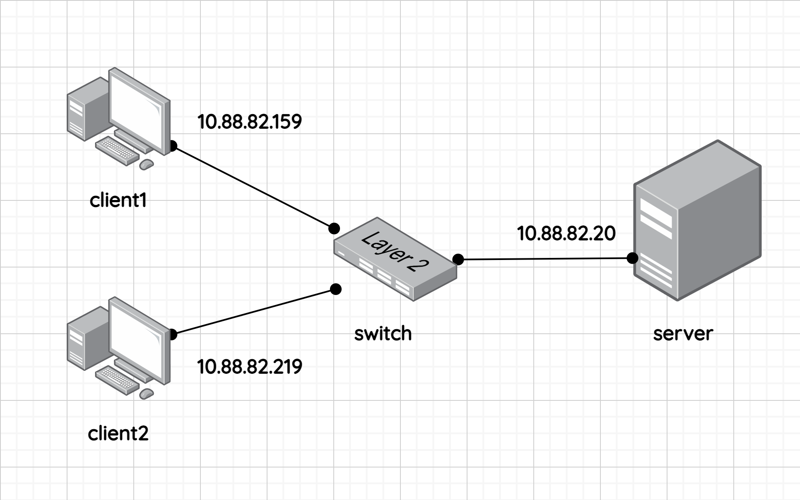

Log management is very important in operation and maintenance, but when the system is too large, we need a place to manage the log of all components. This is why the central server for logging was born.

In this article, we will build a centralized logging server with Syslog-ng in Ubuntu 20.04.
Firstly, we need to prepare the environment. The network looks like this:



The client1, client2, and server are created by multipass. You can read the documentation of this tool here [https://multipass.run/](https://multipass.run/).

To access shell in each virtual machine (VM), typing following command:

```bash
multipass exec <machine-name> -- /bin/bash
```

Notice: The IP address in the below image was found by accessing the shell in each VM and type:

```bash
ip addr show
```

Secondly, we install Syslog-ng in every VM with the command:

```bash
sudo apt-get update
sudo apt-get install syslog-ng -y
```

Enable syslog-ng

```bash
sudo systemctl enable syslog-ng
```

After that, we need to configure each VM in `/etc/syslog-ng/syslog-ng.conf`.

```bash
sudo mv /etc/syslog-ng/syslog-ng.conf /etc/syslog-ng/syslog-ng.conf.bak
sudo nano /etc/syslog-ng/syslog-ng.conf
```

In client1 and client2 the content should be like this:

```txt
@version: 3.5
@include "scl.conf"

options {
  chain_hostnames(off);
  flush_lines(0);
  use_dns(no);
  use_fqdn(no);
  owner("root");
  group("adm");
  perm(0640);
  stats_freq(0);
  bad_hostname("^gconfd$");
  keep-hostname(yes);
  create_dirs(yes);
};

source s_local {
  system();
  internal();
};

destination d_logs {
  file("/var/log/syslog-ng/${YEAR}/${MONTH}/${DAY}/all.log");
};

destination d_syslog_tcp {
  syslog("10.88.82.20" transport("tcp") port(514));
};

log { source(s_local); destination(d_logs); };
log { source(s_local); destination(d_syslog_tcp); };
```

_Notice: create_dirs(yes); in options block is mean that automatically create directories if not exists._

In server it should be like this one:

```txt
@version: 3.5
@include "scl.conf"

options {
  chain_hostnames(off);
  flush_lines(0);
  use_dns(no);
  use_fqdn(no);
  owner("root");
  group("adm");
  perm(0640);
  stats_freq(0);
  bad_hostname("^gconfd$");
  keep-hostname(yes);
  create-dirs(yes);
};

source s_local {
  system();
  internal();
};

source s_network {
  syslog(transport(tcp) port(514));
};

destination d_logs {
  file("/var/log/syslog-ng/${HOST}/${YEAR}/${MONTH}/${DAY}/all.log");
};

log { source(s_local); source(s_network); destination(d_logs); };
```

Type Ctrl+O and Enter to save the file. Ctrl+X to exit to bash.

Restart the syslog-ng service:

```bash
sudo systemctl restart syslog-ng
```

Now, you can read continuously the log by a command (for example on my current date):

In each client:

```bash
sudo tail -f /var/log/syslog-ng/2021/02/16/all.log
```

In the server:

```bash
sudo tail -f /var/log/syslog-ng/server/2021/02/16/all.log
```

Finally, we can see the log is written to the server.

```bash
sudo ls /var/log/syslog-ng
```

And watching the client log by (for example on my current date):

```bash
sudo tail -f /var/log/syslog-ng/client1/2021/02/16/all.log
```
